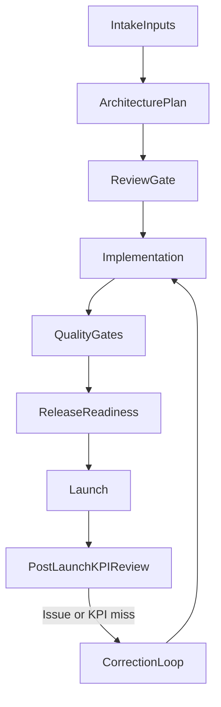
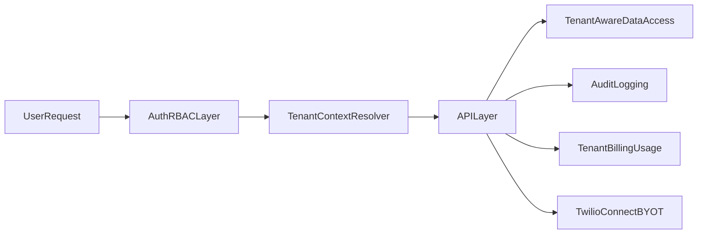
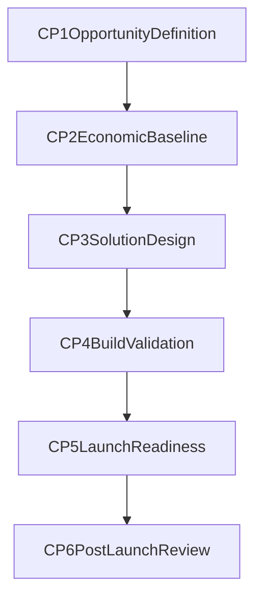

# Architecture and Process Diagrams

## Multi-Agent Delivery Flow

```mermaid
flowchart TD
    intake[IntakeInputs]
    architecture[ArchitecturePlan]
    reviewGate[ReviewGate]
    implementation[Implementation]
    qualityGates[QualityGates]
    releaseReadiness[ReleaseReadiness]
    launch[Launch]
    postLaunch[PostLaunchKPIReview]
    correctionLoop[CorrectionLoop]

    intake --> architecture
    architecture --> reviewGate
    reviewGate --> implementation
    implementation --> qualityGates
    qualityGates --> releaseReadiness
    releaseReadiness --> launch
    launch --> postLaunch
    postLaunch -->|"Issue or KPI miss"| correctionLoop
    correctionLoop --> implementation
```

## Multi-Tenant + BYOT Safety Model

```mermaid
flowchart LR
    userRequest[UserRequest]
    authLayer[AuthRBACLayer]
    tenantContext[TenantContextResolver]
    apiLayer[APILayer]
    dataLayer[TenantAwareDataAccess]
    auditLayer[AuditLogging]
    billingLayer[TenantBillingUsage]
    twilioConnect[TwilioConnectBYOT]

    userRequest --> authLayer
    authLayer --> tenantContext
    tenantContext --> apiLayer
    apiLayer --> dataLayer
    apiLayer --> auditLayer
    apiLayer --> billingLayer
    apiLayer --> twilioConnect
```

## Profitability Checkpoint Sequence

```mermaid
flowchart TD
    cp1[CP1OpportunityDefinition]
    cp2[CP2EconomicBaseline]
    cp3[CP3SolutionDesign]
    cp4[CP4BuildValidation]
    cp5[CP5LaunchReadiness]
    cp6[CP6PostLaunchReview]

    cp1 --> cp2 --> cp3 --> cp4 --> cp5 --> cp6
```
