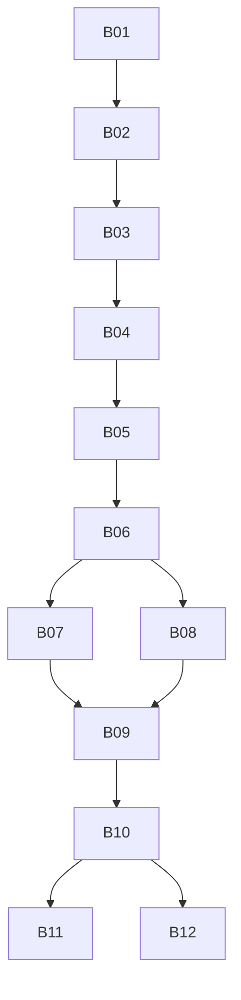

# Reconstruction Backlog (Canonical)

This is the single prioritized backlog for rebuilding the Base44 SaaS from this
repository. Every implementation task must map to one backlog ID.

## Prioritization Model

- Order by profitability impact first: revenue -> conversion -> retention ->
  cost/risk reduction
- Respect hard dependencies and release safety gates from
  `docs/checkpoints-and-procedures.md`
- Keep work in small reversible increments

## Dependency Flow

## Backlog Items

### Revenue

#### B07 - Seller Lead Intake MVP

- **Outcome target:** increase qualified lead submissions
- **Depends on:** `B06`
- **Definition of done:**
  - Seller intake flow implemented end-to-end
  - Lead persisted with tenant context
  - Success/error UX states implemented
- **Validation evidence:**
  - integration test for lead submission path
  - manual verification notes and screenshots
- **Rollback note:** disable route via feature flag and preserve schema

#### B08 - Offer Pipeline Baseline

- **Outcome target:** increase offer creation throughput
- **Depends on:** `B06`
- **Definition of done:**
  - offer record lifecycle states defined
  - create/update endpoints or actions implemented
  - role-based access checks enforced
- **Validation evidence:**
  - API contract tests
  - RBAC verification checklist
- **Rollback note:** lock write actions and revert to read-only mode

### Conversion

#### B09 - Resource/SEO Content Delivery Layer

- **Outcome target:** improve organic conversion from educational pages
- **Depends on:** `B07`, `B08`
- **Definition of done:**
  - normalized content model defined from workflow corpus
  - route structure and metadata generation implemented
  - content rendering parity checks complete
- **Validation evidence:**
  - snapshot tests for metadata and rendering
  - lighthouse baseline comparison
- **Rollback note:** retain prior static fallback renderer

### Retention

#### B10 - Operator Workspace and Task Queue

- **Outcome target:** improve follow-up reliability and operator retention
- **Depends on:** `B09`
- **Definition of done:**
  - operator dashboard with queue states
  - assignment and status transitions
  - audit trail for major state changes
- **Validation evidence:**
  - end-to-end workflow test
  - role-aware UI state screenshots
- **Rollback note:** switch queue actions to read-only state

### Cost/Risk Reduction

#### B01 - Monorepo Bootstrap for App Implementation

- **Outcome target:** reduce execution risk and restart cost
- **Depends on:** none
- **Definition of done:**
  - initialize app workspace structure in `apps/`, `packages/`, `infra/`
  - configure TypeScript, lint, formatting, and base scripts
  - CI checks run on pull requests
- **Validation evidence:**
  - clean install and successful CI run
- **Rollback note:** remove scaffold in isolated revert commit

#### B02 - Multi-Tenant Domain and Data Contract

- **Outcome target:** reduce high-severity security and data risks
- **Depends on:** `B01`
- **Definition of done:**
  - tenant identity propagation contract documented
  - initial schema plan and isolation strategy documented
  - RBAC matrix draft approved
- **Validation evidence:**
  - architecture review sign-off
  - threat/risk checklist completed
- **Rollback note:** no production migration at this stage

#### B03 - Auth and Access Foundation

- **Outcome target:** reduce unauthorized-access risk
- **Depends on:** `B02`
- **Definition of done:**
  - authentication baseline integrated
  - role-guard middleware/policies implemented
  - audit logging for privileged actions
- **Validation evidence:**
  - auth unit/integration tests
  - negative-case authorization tests
- **Rollback note:** emergency read-only mode for privileged endpoints

#### B04 - Billing and Subscription Skeleton

- **Outcome target:** unlock monetization path and enforce tenant billing limits
- **Depends on:** `B03`
- **Definition of done:**
  - subscription entities/events mapped
  - billing provider integration skeleton implemented
  - usage boundary checks documented
- **Validation evidence:**
  - webhook contract tests
  - event idempotency verification
- **Rollback note:** suspend billing webhooks and retain account access policy

#### B05 - BYOT Telephony Connect Baseline

- **Outcome target:** enable telephony capability without credential liability
- **Depends on:** `B04`
- **Definition of done:**
  - delegated connection flow defined and implemented
  - no raw telco credential persistence
  - tenant-scoped permission checks enforced
- **Validation evidence:**
  - security review against BYOT constraints
  - failure-path logging verification
- **Rollback note:** disable connect actions while keeping tenant configuration

#### B06 - Core API and Job Runtime

- **Outcome target:** reduce delivery risk for all product modules
- **Depends on:** `B05`
- **Definition of done:**
  - core service boundaries established
  - background job runner with idempotent retry policy
  - structured logs with tenant and request IDs
- **Validation evidence:**
  - integration tests for retries/idempotency
  - logging field conformance checks
- **Rollback note:** disable job consumers and drain queues safely

#### B11 - Performance and Accessibility Hardening

- **Outcome target:** protect conversion while reducing support burden
- **Depends on:** `B10`
- **Definition of done:**
  - WCAG AA checks for key journeys
  - performance budgets and telemetry thresholds established
  - top bottlenecks remediated
- **Validation evidence:**
  - accessibility audit report
  - performance benchmark report
- **Rollback note:** revert isolated optimization commits by area

#### B12 - Release Readiness and Runbook

- **Outcome target:** reduce launch risk and incident resolution time
- **Depends on:** `B10`
- **Definition of done:**
  - launch checklist completed (CP5)
  - monitoring/alerts and rollback triggers documented
  - post-launch review template created (CP6)
- **Validation evidence:**
  - dry-run release review
  - rollback rehearsal notes
- **Rollback note:** hold release; no production promotion

## Active Sprint Seed (First 5 Executable Items)

1. `B01` Monorepo bootstrap
2. `B02` Multi-tenant domain/data contract
3. `B03` Auth/access foundation
4. `B04` Billing skeleton
5. `B05` BYOT telephony baseline

## Intake Rule

No task may enter implementation unless:

- it references a backlog ID from this document,
- CP1-CP3 artifacts exist for that ID,
- and an explicit rollback note is included.
